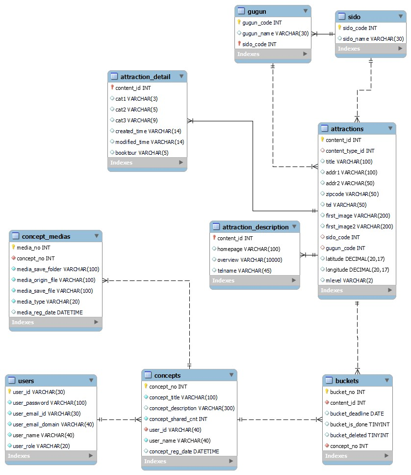

# WANNAGO

<div align="center">


</div>

# 개요

### 소개

#### 공공데이터를 기반으로 여행지 정보들을 조회하고,버킷 여행지들을 담은 컨셉을 만들어 관리하는 커뮤니티 서비스

### 개발기간

#### 2023.11 ~ 2023.12

# ERD

<div align="center">

</div>

# 환경

### Backend


### DataBase


### Communication


# 디렉토리 구조

```bash
📦src
 ┣ 📂main
 ┃ ┣ 📂java
 ┃ ┃ ┗ 📂com
 ┃ ┃ ┃ ┗ 📂ssafy
 ┃ ┃ ┃ ┃ ┗ 📂wannago
 ┃ ┃ ┃ ┃ ┃ ┣ 📂attraction : 여행지 정보 api
 ┃ ┃ ┃ ┃ ┃ ┃ ┣ 📂controller
 ┃ ┃ ┃ ┃ ┃ ┃ ┃ ┗ 📜AttractionController.java
 ┃ ┃ ┃ ┃ ┃ ┃ ┗ 📂model
 ┃ ┃ ┃ ┃ ┃ ┃ ┃ ┣ 📂mapper
 ┃ ┃ ┃ ┃ ┃ ┃ ┃ ┃ ┗ 📜AttractionMapper.java
 ┃ ┃ ┃ ┃ ┃ ┃ ┃ ┣ 📂service
 ┃ ┃ ┃ ┃ ┃ ┃ ┃ ┃ ┣ 📜AttractionService.java
 ┃ ┃ ┃ ┃ ┃ ┃ ┃ ┃ ┗ 📜AttractionServiceImpl.java
 ┃ ┃ ┃ ┃ ┃ ┃ ┃ ┣ 📜AttractionJoinDescriptionDto.java
 ┃ ┃ ┃ ┃ ┃ ┃ ┃ ┗ 📜AttractionResponseDto.java
 ┃ ┃ ┃ ┃ ┃ ┣ 📂bucket : 버킷 정보 api
 ┃ ┃ ┃ ┃ ┃ ┃ ┣ 📂controller
 ┃ ┃ ┃ ┃ ┃ ┃ ┃ ┗ 📜BucketController.java
 ┃ ┃ ┃ ┃ ┃ ┃ ┗ 📂model
 ┃ ┃ ┃ ┃ ┃ ┃ ┃ ┣ 📂mapper
 ┃ ┃ ┃ ┃ ┃ ┃ ┃ ┃ ┗ 📜BucketMapper.java
 ┃ ┃ ┃ ┃ ┃ ┃ ┃ ┣ 📂service
 ┃ ┃ ┃ ┃ ┃ ┃ ┃ ┃ ┣ 📜BucketService.java
 ┃ ┃ ┃ ┃ ┃ ┃ ┃ ┃ ┗ 📜BucketServiceImpl.java
 ┃ ┃ ┃ ┃ ┃ ┃ ┃ ┣ 📜BucketDto.java
 ┃ ┃ ┃ ┃ ┃ ┃ ┃ ┣ 📜BucketJoinAttractionDto.java
 ┃ ┃ ┃ ┃ ┃ ┃ ┃ ┗ 📜BucketResponseDto.java
 ┃ ┃ ┃ ┃ ┃ ┣ 📂concept : 컨셉 정보 api
 ┃ ┃ ┃ ┃ ┃ ┃ ┣ 📂controller
 ┃ ┃ ┃ ┃ ┃ ┃ ┃ ┗ 📜ConceptController.java
 ┃ ┃ ┃ ┃ ┃ ┃ ┗ 📂model
 ┃ ┃ ┃ ┃ ┃ ┃ ┃ ┣ 📂mapper
 ┃ ┃ ┃ ┃ ┃ ┃ ┃ ┃ ┗ 📜ConceptMapper.java
 ┃ ┃ ┃ ┃ ┃ ┃ ┃ ┣ 📂service
 ┃ ┃ ┃ ┃ ┃ ┃ ┃ ┃ ┣ 📜ConceptService.java
 ┃ ┃ ┃ ┃ ┃ ┃ ┃ ┃ ┗ 📜ConceptServiceImpl.java
 ┃ ┃ ┃ ┃ ┃ ┃ ┃ ┣ 📜ConceptDetailResponseDto.java
 ┃ ┃ ┃ ┃ ┃ ┃ ┃ ┣ 📜ConceptDto.java
 ┃ ┃ ┃ ┃ ┃ ┃ ┃ ┣ 📜ConceptResponseDto.java
 ┃ ┃ ┃ ┃ ┃ ┃ ┃ ┗ 📜ConceptSearchResponseDto.java
 ┃ ┃ ┃ ┃ ┃ ┣ 📂errorcode : custom errorcode
 ┃ ┃ ┃ ┃ ┃ ┃ ┣ 📜AttractionErrorCode.java
 ┃ ┃ ┃ ┃ ┃ ┃ ┣ 📜BucketErrorCode.java
 ┃ ┃ ┃ ┃ ┃ ┃ ┣ 📜ConceptErrorCode.java
 ┃ ┃ ┃ ┃ ┃ ┃ ┣ 📜CredentialErrorCode.java
 ┃ ┃ ┃ ┃ ┃ ┃ ┣ 📜FileErrorCode.java
 ┃ ┃ ┃ ┃ ┃ ┃ ┣ 📜JwtErrorCode.java
 ┃ ┃ ┃ ┃ ┃ ┃ ┗ 📜MediaErrorCode.java
 ┃ ┃ ┃ ┃ ┃ ┣ 📂exception : 예외처리 클래스
 ┃ ┃ ┃ ┃ ┃ ┃ ┣ 📜AttractionException.java
 ┃ ┃ ┃ ┃ ┃ ┃ ┣ 📜BucketException.java
 ┃ ┃ ┃ ┃ ┃ ┃ ┣ 📜ConceptException.java
 ┃ ┃ ┃ ┃ ┃ ┃ ┣ 📜CredentialException.java
 ┃ ┃ ┃ ┃ ┃ ┃ ┣ 📜CustomException.java
 ┃ ┃ ┃ ┃ ┃ ┃ ┣ 📜FileException.java
 ┃ ┃ ┃ ┃ ┃ ┃ ┣ 📜JwtException.java
 ┃ ┃ ┃ ┃ ┃ ┃ ┗ 📜MediaException.java
 ┃ ┃ ┃ ┃ ┃ ┣ 📂file : 이미지 처리 클래스
 ┃ ┃ ┃ ┃ ┃ ┃ ┗ 📂utils
 ┃ ┃ ┃ ┃ ┃ ┃ ┃ ┣ 📜FileUtil.java
 ┃ ┃ ┃ ┃ ┃ ┃ ┃ ┣ 📜FileUtilFactory.java
 ┃ ┃ ┃ ┃ ┃ ┃ ┃ ┣ 📜FileUtilFactoryImpl.java
 ┃ ┃ ┃ ┃ ┃ ┃ ┃ ┣ 📜FileUtilImpl.java
 ┃ ┃ ┃ ┃ ┃ ┃ ┃ ┗ 📜ThreadStreamImage.java
 ┃ ┃ ┃ ┃ ┃ ┣ 📂jwt : 로그인 토큰 관련 클래스
 ┃ ┃ ┃ ┃ ┃ ┃ ┣ 📜AuthToken.java
 ┃ ┃ ┃ ┃ ┃ ┃ ┣ 📜AuthTokenProvider.java
 ┃ ┃ ┃ ┃ ┃ ┃ ┣ 📜JwtAuthenticationEntryPoint.java
 ┃ ┃ ┃ ┃ ┃ ┃ ┣ 📜JwtAuthToken.java
 ┃ ┃ ┃ ┃ ┃ ┃ ┗ 📜JwtAuthTokenProvider.java
 ┃ ┃ ┃ ┃ ┃ ┣ 📂main
 ┃ ┃ ┃ ┃ ┃ ┃ ┗ 📂controller
 ┃ ┃ ┃ ┃ ┃ ┃ ┃ ┣ 📜ExceptionControllerAdvice.java
 ┃ ┃ ┃ ┃ ┃ ┃ ┃ ┗ 📜MainController.java
 ┃ ┃ ┃ ┃ ┃ ┣ 📂media
 ┃ ┃ ┃ ┃ ┃ ┃ ┣ 📂controller
 ┃ ┃ ┃ ┃ ┃ ┃ ┃ ┗ 📜MediaController.java
 ┃ ┃ ┃ ┃ ┃ ┃ ┗ 📂model
 ┃ ┃ ┃ ┃ ┃ ┃ ┃ ┣ 📂mapper
 ┃ ┃ ┃ ┃ ┃ ┃ ┃ ┃ ┗ 📜MediaMapper.java
 ┃ ┃ ┃ ┃ ┃ ┃ ┃ ┣ 📂service
 ┃ ┃ ┃ ┃ ┃ ┃ ┃ ┃ ┣ 📜MediaService.java
 ┃ ┃ ┃ ┃ ┃ ┃ ┃ ┃ ┗ 📜MediaServiceImpl.java
 ┃ ┃ ┃ ┃ ┃ ┃ ┃ ┣ 📜MediaDto.java
 ┃ ┃ ┃ ┃ ┃ ┃ ┃ ┗ 📜MediaResponseDto.java
 ┃ ┃ ┃ ┃ ┃ ┣ 📂oauth : 소셜로그인 관련 클래스
 ┃ ┃ ┃ ┃ ┃ ┃ ┗ 📂controller
 ┃ ┃ ┃ ┃ ┃ ┃ ┃ ┗ 📜OauthController.java
 ┃ ┃ ┃ ┃ ┃ ┣ 📂response
 ┃ ┃ ┃ ┃ ┃ ┃ ┣ 📜ResponseAdvice.java
 ┃ ┃ ┃ ┃ ┃ ┃ ┗ 📜ResponseDto.java
 ┃ ┃ ┃ ┃ ┃ ┣ 📂security : spring boot security설정 클래스
 ┃ ┃ ┃ ┃ ┃ ┃ ┗ 📂configure
 ┃ ┃ ┃ ┃ ┃ ┃ ┃ ┣ 📜JwtFilter.java
 ┃ ┃ ┃ ┃ ┃ ┃ ┃ ┗ 📜SecurityConfig.java
 ┃ ┃ ┃ ┃ ┃ ┣ 📂user : 회원 클래스
 ┃ ┃ ┃ ┃ ┃ ┃ ┣ 📂controller
 ┃ ┃ ┃ ┃ ┃ ┃ ┃ ┗ 📜UserContoller.java
 ┃ ┃ ┃ ┃ ┃ ┃ ┗ 📂model
 ┃ ┃ ┃ ┃ ┃ ┃ ┃ ┣ 📂mapper
 ┃ ┃ ┃ ┃ ┃ ┃ ┃ ┃ ┗ 📜UserMapper.java
 ┃ ┃ ┃ ┃ ┃ ┃ ┃ ┣ 📂service
 ┃ ┃ ┃ ┃ ┃ ┃ ┃ ┃ ┣ 📜UserService.java
 ┃ ┃ ┃ ┃ ┃ ┃ ┃ ┃ ┗ 📜UserServiceImpl.java
 ┃ ┃ ┃ ┃ ┃ ┃ ┃ ┣ 📜UserDto.java
 ┃ ┃ ┃ ┃ ┃ ┃ ┃ ┗ 📜UserResponseDto.java
 ┃ ┃ ┃ ┃ ┃ ┗ 📜WannagoApplication.java
 ┃ ┗ 📂resources
 ┃ ┃ ┣ 📂mapper : mybatis 설정 파일
 ┃ ┃ ┃ ┣ 📜attractions.xml
 ┃ ┃ ┃ ┣ 📜buckets.xml
 ┃ ┃ ┃ ┣ 📜concepts.xml
 ┃ ┃ ┃ ┣ 📜medias.xml
 ┃ ┃ ┃ ┗ 📜users.xml
 ┃ ┃ ┗ 📜.gitignore
```
